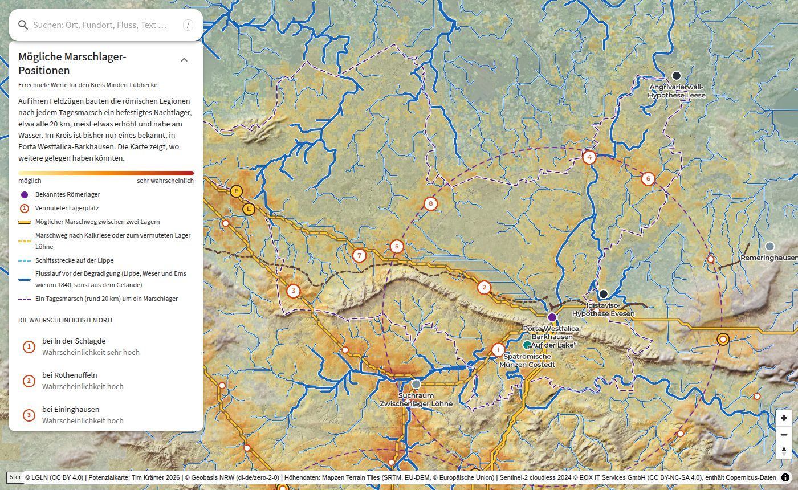

# Römerlager Westfalen

[](https://github.com/TimKraemer/roemerlager-westfalen/actions/workflows/ci.yml)
[](LICENSE)
[](docs/daten.md)

Web-Karte der bekannten augusteischen Römerlager in Westfalen und Umgebung
mit einem offenen Potenzialmodell für noch unentdeckte Marschlager. Die
Karte zeigt Suchräume für Prospektion und Laserscan-Auswertung, keine
Fundstellen.

Live: https://experiments.erleben.app/roemer/



> In English: An interactive map of the known Augustan Roman military camps
> in Westphalia (Germany) and a transparent predictive model for
> undiscovered marching camps, based on a day's march between camps, water,
> terrain and least-cost marching routes, tested by leave-one-out
> validation. Everything runs in the browser as a static site. The code and
> most texts were written with AI (Claude by Anthropic) under human
> direction, see [Entstehung mit KI](#entstehung-mit-ki). The interface and
> documentation are in German.

## Inhalt

- 39 Fundstellen von Vetera am Rhein bis Hachelbich in Thüringen, mit Typ, Datierung, Genauigkeit der Lage und Quellen
- Potenzialkarte aus sieben Kriterien mit einstellbaren Gewichten, vorberechnet für den Kreis Minden-Lübbecke und für jeden Ausschnitt im Browser rechenbar
- Marschwege-Netz als Weg geringster Gehzeit zwischen den Lagern, mit Etappenhalten und Schiffsstrecke auf der Lippe
- Gegenprobe des Modells, bei der je ein bekanntes Lager weggelassen wird
- antike Textstellen (Tacitus, Velleius, Florus, Cassius Dio, Ps.-Hyginus, Vegetius) mit Übersetzung und Kartenbezug
- Ebenen für Luftbild, Laserscan-Schummerung, Preußische Uraufnahme, Bodenkarten, Moore, Römerstraßen, alte Flussläufe und entzerrte Altkarten, historische Karten nach Jahr, dazu Gewässer, Moore, Wald und Wege um 1840
- Suche über Fundstellen, Texte, Ebenen und heutige Orte, eigene Karten per WMS, GeoJSON, KML oder Bild mit World-File

Anstoß war der Vortrag von Dr. Bettina Tremmel (LWL-Archäologie für
Westfalen) auf der Regionalkonferenz des Kreisheimatbundes
Minden-Lübbecke. Nach ihrer Arbeitshypothese lagen Marschlager etwa einen
Tagesmarsch (18–20 km) auseinander, nahe fließendem Wasser und meist auf
Anhöhen oder in leichter Hanglage. Das Projekt ist ein privates Vorhaben
und keine Veröffentlichung der LWL-Archäologie.

## Entstehung mit KI

Dieses Projekt ist weitgehend mit künstlicher Intelligenz entstanden. Tim
Krämer hat Fragestellung und Richtung vorgegeben, die Arbeit in vielen
Sitzungen angeleitet, Zwischenstände in der App geprüft und entschieden, was
bleibt. Programmcode, Rechenmodell, Skripte, Erklärtexte, Übersetzungen und
diese Dokumentation hat das Sprachmodell Claude (Anthropic) über
[Claude Code](https://claude.com/claude-code) geschrieben. Commits mit KI-Anteil tragen die Zeile
`Co-Authored-By: Claude …`. Die Dateien `AGENTS.md` und `CLAUDE.md` sind
Arbeitsanweisungen für KI-Agenten.

Was das für die Nutzung heißt:

- Literaturangaben wurden per DOI, Crossref, DataCite oder Bibliothekskatalog nachgeschlagen, wo das ging. Sprachmodelle erfinden Quellen. Bitte jede Angabe vor dem Zitieren am Original prüfen.
- Die Übersetzungen der antiken Texte sind mit KI erstellt und nicht philologisch geprüft.
- Das Modell ist eine nachvollziehbare Rechenvorschrift, kein archäologisches Gutachten. Seine Annahmen und Grenzen stehen in [docs/modell.md](docs/modell.md).
- Fehler bitte als [Issue](https://github.com/TimKraemer/roemerlager-westfalen/issues) melden, möglichst mit Beleg.

## Schnellstart

Voraussetzung ist [Bun](https://bun.sh) ab Version 1.3.

```bash
git clone https://github.com/TimKraemer/roemerlager-westfalen.git
cd roemerlager-westfalen
bun install
bun run dev
```

Danach http://localhost:3000/ öffnen. Die Startansicht zeigt den Kreis
Minden-Lübbecke mit vorberechneter Analyse.

Mit Docker statt Bun:

```bash
docker build -t roemerlager .
docker run --rm -p 8080:80 roemerlager
```

Danach http://localhost:8080/ öffnen.

## Konfiguration

Alle Einstellungen haben Standardwerte und sind optional. Lokal kommen sie
in `.env.local` (Vorlage [.env.example](.env.example)), beim Deploy in
`deploy/deploy.env`, bei Docker als `--build-arg`.

| Variable | Standard | Bedeutung |
|----------|----------|-----------|
| `BASE_PATH` | leer | Unterpfad der App, z. B. `/roemer` |
| `NEXT_PUBLIC_SITE_URL` | `https://experiments.erleben.app/roemer/` | Adresse im Zitiervorschlag |
| `NEXT_PUBLIC_DEM_TILES` | `https://tiles.erleben.app/dem/{z}/{x}/{y}` | Höhenkacheln im Terrarium-Format, Rückfall auf AWS Terrain Tiles |
| `NEXT_PUBLIC_VECTOR_TILES` | `https://tiles.erleben.app/germany/{z}/{x}/{y}` | Vektorkacheln im OpenMapTiles-Schema, z. B. von [OpenFreeMap](https://openfreemap.org) |
| `NEXT_PUBLIC_GLYPHS` | `https://tiles.erleben.app/font/{fontstack}/{range}` | Schriften für Beschriftungen |

Die Standard-Kacheldienste auf tiles.erleben.app beantworten Browser-Anfragen
nur von den Domains von erleben.app und von localhost. Wer die App unter einer
eigenen Domain betreibt, muss eigene Dienste für Vektorkacheln und Schriften
eintragen. Das Höhenmodell fällt ohne eigenen Dienst auf AWS Terrain Tiles
zurück.
Inhaltliche Einstellungen (Regionen, Fundstellen, Ebenen, Modellgewichte)
stehen im Code, siehe [CONTRIBUTING.md](CONTRIBUTING.md#erweitern).

## Auf einem eigenen Server betreiben

Die App ist ein statischer Export. Alles rechnet im Browser, der Server
liefert nur Dateien aus dem Ordner `out/` aus. Jeder Webserver genügt, der
`.mjs` als JavaScript ausliefert ([deploy/nginx.conf](deploy/nginx.conf)
zeigt eine passende nginx-Konfiguration).

Damit wiederholte Besuche schnell laden, hängt der Build an Daten unter
`public/` eine Prüfsumme (`?v=…`). Solche Dateien darf der Browser
unbegrenzt cachen, die nginx-Konfiguration erlaubt das für `precomputed/`,
`altkarten/`, `models/` und `csl/`. `bun run build` legt außerdem stark
gepackte `.gz`-Fassungen an, die nginx per `gzip_static` ausliefert. Im
Browser hält ein Service Worker ([public/sw.js](public/sw.js)) Kacheln
fremder Dienste 14 Tage vor, weil viele amtliche WMS keine Cache-Header
senden.

```bash
BASE_PATH=/roemer bun run build   # Ergebnis in out/
```

Für wiederholte Deploys per rsync:

```bash
cp deploy/deploy.env.example deploy/deploy.env   # Ziel und Unterpfad eintragen
bun run deploy                                    # Tests, Build, rsync
```

Als vollständiges Beispiel dient die Referenzinstanz auf
experiments.erleben.app. Ihre Dateien (Compose-Dienst, nginx-Konfiguration,
Einrichtungsskript, Einstellungen) liegen in [deploy/erleben/](deploy/erleben/).

Die Kacheln der Altkarten sind nicht im Repository, weil sie aus Scans
gerechnet werden (177 MB). Ohne sie blendet die App diese Karten unter
„Historische Karten“ aus. Wie man sie erzeugt, steht in [docs/daten.md](docs/daten.md#altkarten).

## Aufbau

Next.js 16 (App Router, statischer Export), React 19, MUI 9, MapLibre GL 6,
zustand, Bun und Biome. JavaScript ohne TypeScript.

| Pfad | Inhalt |
|------|--------|
| `src/config.js` | Unterpfad, Kacheldienste, Zitierangaben |
| `src/data/` | Fundstellen, Quellen, Literatur (CSL-JSON), Texte, Römerstraßen, alte Flussläufe, Altkarten |
| `src/lib/literature.js`, `cite.js`, `layer-sources.js` | Literaturverweise auflösen, Zitierstile und Exporte, Quellen je Kartenebene |
| `src/lib/potential/` | Rechenmodell (`model.js`), Rechenkette (`pipeline.js`), Gewässernetz, Routen, Linienerkennung, Web Worker |
| `src/lib/layers.js` | Grundkarten und zuschaltbare Ebenen |
| `src/lib/regions.js` | Vorberechnete Regionen und Marschwege-Netz |
| `src/lib/criteria.js` | Erklärtexte und Belege je Kriterium |
| `src/components/` | Karte, Seitenleiste, Info-Karten, Suche |
| `scripts/` | Vorberechnung, Gegenprobe und Bau der Datensätze |
| `public/precomputed/` | Vorberechnete Ergebnisse |
| `public/csl/` | Zitierstile (Citation Style Language) |
| `deploy/` | Deploy-Skript, nginx-Konfiguration, Beispielserver |
| `docs/` | Methode ([modell.md](docs/modell.md)) sowie Daten, Herkunft und Lizenzen ([daten.md](docs/daten.md)) |

## Potenzialmodell

Der Kartenausschnitt wird in Zellen von 100–500 m zerlegt. Jede Zelle
bekommt Teilwerte für Tagesmarsch zum nächsten bekannten Lager,
Fließgewässer, Anhöhe, Terrasse über der Aue, Hanglage, Nähe zu einer
möglichen Marschroute und Flusskorridor. Der Gesamtwert ist ihr gewichtetes
Mittel, mit Abzügen für Moore, nasse Niederungen und steiles Gelände.

In der Gegenprobe lag die Stelle eines weggelassenen Lagers im Median über
86 % aller Zellen, bei Zufallsorten über 48 %. Rechengang, Ergebnisse und
Grenzen stehen in [docs/modell.md](docs/modell.md).

## Zitieren

Der Reiter „Quellen“ zeigt den Zitiervorschlag in den Stilen des Deutschen
Archäologischen Instituts (DAI), DIN 1505-2, APA 7, Chicago und Harvard und
liefert ihn als BibTeX, BibLaTeX, RIS und CSL-JSON. Beim Kopieren bleibt die
Kursivschrift erhalten, wenn man in Word oder LibreOffice einfügt. Jede
Kartenebene hat unter „Quellen und zitieren“ eigene Angaben. Ebenen, die die
Anwendung selbst erzeugt (Potenzialkarte, Marschwege, entzerrte Altkarten
usw.), werden als Teil dieses Werks zitiert, zusammen mit den Daten und
Methoden, aus denen sie entstehen. Fremde Kartendienste nennen ihren
Anbieter. Das ganze Literaturverzeichnis lässt sich dort als `.bib` oder
`.ris` herunterladen.

APA 7:

> Krämer, T. (2026). Römerlager in Westfalen. Potenzialkarte für unentdeckte
> Marschlager (Version 0.1.0) [Software]. https://experiments.erleben.app/roemer/

BibLaTeX (mit biber):

```bibtex
@software{kraemer2026roemerlager,
	author = {Krämer, Tim},
	date = {2026},
	title = {Römerlager in {Westfalen}. {Potenzialkarte} für unentdeckte {Marschlager}},
	version = {0.1.0},
	url = {https://experiments.erleben.app/roemer/},
	urldate = {2026-10-06},
}
```

Quelltext: https://github.com/TimKraemer/roemerlager-westfalen.
Maschinenlesbar in [CITATION.cff](CITATION.cff), GitHub zeigt dazu rechts
„Cite this repository“.

## Lizenz

- Code: [MIT](LICENSE)
- eigene Daten und Texte (Fundstellen-Zusammenstellung, Quellen, Texte, Erklärungen, vorberechnete Ergebnisse): [CC BY 4.0](https://creativecommons.org/licenses/by/4.0/deed.de)
- Daten aus OpenStreetMap (Ortsverzeichnis, Gebiete, Flussläufe, Kreisgrenze): [ODbL 1.0](https://opendatacommons.org/licenses/odbl/), © OpenStreetMap-Mitwirkende
- Altkarten-Scans: je nach Archiv Public Domain Mark oder CC BY-SA 4.0
- 3D-Modell Oberaden: © erleben.app, alle Rechte vorbehalten
- Zitierstile in `public/csl/` aus dem CSL-Projekt: [CC BY-SA 3.0](https://creativecommons.org/licenses/by-sa/3.0/deed.de), DAI-Stil angepasst

Die Aufstellung je Datei steht in [docs/daten.md](docs/daten.md).

## Mitwirken

Hinweise, Korrekturen und Pull Requests sind willkommen. Wie man
Fundstellen, Regionen, Ebenen oder Texte ergänzt, steht in
[CONTRIBUTING.md](CONTRIBUTING.md).
